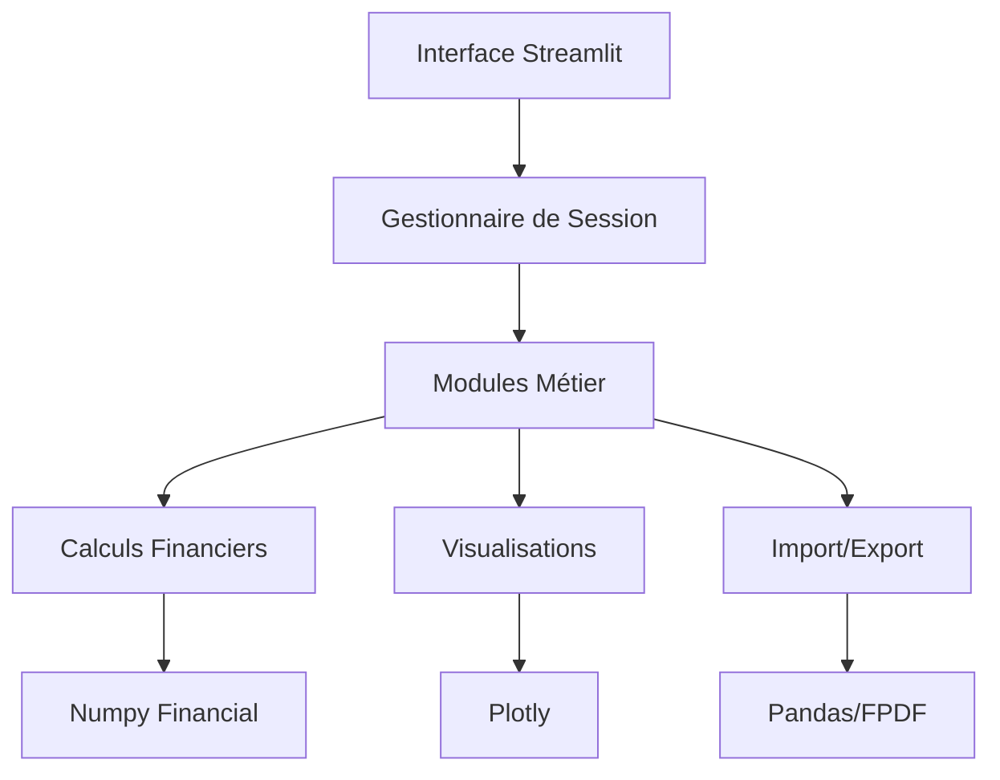

# 💼 Simulateur d'Étude Financière

<div align="center">


*Un outil complet et intuitif pour la création et l'analyse d'études financières d'entreprise*

[🚀 Démarrage Rapide](#-démarrage-rapide) • [📖 Documentation](#-documentation) • [🎯 Fonctionnalités](#-fonctionnalités) • [🛠️ Installation](#️-installation)

</div>

---

## 📋 Table des Matières

- [🎯 Vue d'ensemble](#-vue-densemble)
- [✨ Fonctionnalités Principales](#-fonctionnalités-principales)
- [🛠️ Installation](#️-installation)
- [🚀 Démarrage Rapide](#-démarrage-rapide)
- [📖 Guide d'Utilisation](#-guide-dutilisation)
- [🏗️ Architecture](#️-architecture)
- [📊 Modules Détaillés](#-modules-détaillés)
- [🎨 Interface Utilisateur](#-interface-utilisateur)
- [📤 Import/Export](#-importexport)
- [🔧 Configuration](#-configuration)
- [🤝 Contribution](#-contribution)
- [📝 Licence](#-licence)

---

## 🎯 Vue d'ensemble

Le **Simulateur d'Étude Financière** est une application web développée avec Streamlit qui permet aux entrepreneurs, consultants et analystes financiers de créer des études financières complètes et professionnelles. L'outil combine la puissance du calcul automatisé avec une interface intuitive pour produire des analyses financières détaillées.

### 🌟 Points Forts

- **Interface Moderne** : Design responsive avec thème sombre adaptatif
- **Calculs Automatisés** : Métriques financières avancées (VAN, TRI, ROI)
- **Visualisations Dynamiques** : Graphiques interactifs avec Plotly
- **Import/Export Intelligent** : Support CSV avec IA d'analyse automatique
- **Rapports PDF** : Génération de rapports professionnels complets
- **Sauvegarde Complète** : Système de sauvegarde et restauration des projets

---

## ✨ Fonctionnalités Principales

### 🏢 Gestion d'Entreprise
- **Fiche Entreprise** : Informations complètes (raison sociale, forme juridique, secteur d'activité)
- **Données Légales** : Gestion des identifiants fiscaux et coordonnées

### 💰 Analyse Financière
- **Plan de Financement** : Gestion des apports, crédits et subventions
- **Immobilisations** : Suivi détaillé des investissements par catégorie
- **Bilan Prévisionnel** : Actif/Passif avec vérification d'équilibre automatique
- **Compte de Résultat** : Projections sur 3 ans avec taux de croissance paramétrables

### 📊 Tableaux de Bord
- **Cash Flow** : Analyse des flux de trésorerie avec calcul VAN/TRI
- **Trésorerie Mensuelle** : Suivi détaillé sur 12 mois
- **Budget TVA** : Gestion complète de la TVA collectée et déductible
- **Amortissements** : Tableaux détaillés par immobilisation

### 🎓 Formation Intégrée
- **Initiation à la Finance** : Vidéos pédagogiques YouTube intégrées
- **Glossaire Financier** : Définitions des termes techniques
- **Guides Pratiques** : Conseils pour débutants

### 🤖 Intelligence Artificielle
- **Analyse Automatique** : Traitement intelligent des données CSV
- **Détection de Colonnes** : Reconnaissance automatique des types de données
- **Validation des Données** : Contrôles de cohérence et suggestions d'amélioration

---

## 🛠️ Installation

### Prérequis Système

```bash
# Python 3.8 ou supérieur
python --version  # Doit afficher Python 3.8+

# Gestionnaire de paquets pip
pip --version
```

### Installation Standard

1. **Cloner le repository**
```bash
git clone https://github.com/votre-username/simulateur-etude-financiere.git
cd simulateur-etude-financiere
```

2. **Créer un environnement virtuel** (recommandé)
```bash
# Avec venv
python -m venv venv
source venv/bin/activate  # Linux/Mac
# ou
venv\Scripts\activate  # Windows

# Avec conda
conda create -n finance-sim python=3.8
conda activate finance-sim
```

3. **Installer les dépendances**
```bash
pip install -r requirements.txt
```

### Installation avec Docker

```bash
# Construction de l'image
docker build -t finance-simulator .

# Lancement du conteneur
docker run -p 8501:8501 finance-simulator
```

### Dépendances Principales

```txt
streamlit>=1.28.0
pandas>=1.5.0
numpy>=1.24.0
plotly>=5.15.0
fpdf2>=2.7.0
Pillow>=9.5.0
openpyxl>=3.1.0
python-dateutil>=2.8.0
```

### Dépendances Optionnelles

```txt
# Pour les calculs financiers avancés
numpy-financial>=1.0.0
pyfinance>=1.3.0

# Pour l'analyse HTML (import avancé)
beautifulsoup4>=4.12.0
lxml>=4.9.0

# Pour l'analyse de données avancée
seaborn>=0.12.0
```

---

## 🚀 Démarrage Rapide

### Lancement de l'Application

```bash
# Naviguer vers le dossier du projet
cd simulateur-etude-financiere

# Activer l'environnement virtuel
source venv/bin/activate  # Linux/Mac
# ou
venv\Scripts\activate  # Windows

# Lancer l'application
streamlit run finalt_ar.py
```

L'application sera accessible à l'adresse : `http://localhost:8501`

### Premier Projet

1. **Renseigner les informations de base**
   - Aller dans "Fiche Entreprise"
   - Saisir le nom, forme juridique, secteur d'activité

2. **Définir les investissements**
   - Section "Investissements"
   - Ajouter immobilisations, crédits, subventions

3. **Construire le bilan**
   - Section "Bilan"
   - Vérifier l'équilibre actif/passif

4. **Projeter les résultats**
   - Section "Compte de Résultat"
   - Paramétrer les taux de croissance

5. **Analyser la rentabilité**
   - Section "Cash Flow"
   - Examiner VAN, TRI, délai de récupération

---

## 📖 Guide d'Utilisation

### 🏢 Configuration Initiale

#### Fiche Entreprise
La fiche entreprise constitue la base de votre étude. Renseignez :

- **Informations légales** : Raison sociale, forme juridique (SARL, SA, etc.)
- **Informations temporelles** : Date de création, clôture d'exercice
- **Secteur d'activité** : Classification détaillée
- **Coordonnées** : Adresse, téléphone, email

#### Synchronisation Automatique
Les données saisies dans la fiche entreprise sont automatiquement synchronisées avec tous les autres modules.

### 💰 Gestion Financière

#### Plan d'Investissement
```
Frais Préliminaires
├── Enregistrement de marque
├── Frais de constitution
└── Autres frais de démarrage

Immobilisations
├── Corporelles (équipements, véhicules)
├── Incorporelles (logiciels, brevets)
└── Non-valeur (frais préliminaires)

Financement
├── Apports (numéraire, nature)
├── Emprunts (bancaires, autres)
└── Subventions (publiques, privées)
```

#### Validation Automatique
- Contrôle d'équilibre du plan de financement
- Alertes en cas de déséquilibre
- Suggestions d'ajustement

### 📊 Analyses et Projections

#### Compte de Résultat Dynamique
- **Paramètres configurables** : Taux de croissance annuels
- **Calculs automatiques** : Charges, résultats, impôts
- **Visualisations** : Graphiques d'évolution sur 3 ans

#### Métriques Calculées
```python
# Indicateurs de rentabilité
ROI = (Bénéfice Annuel / Investissement Initial) × 100
Délai de récupération = Investissement Initial / Cash-flow mensuel
VAN = Σ(Cash-flow / (1+taux)^n) - Investissement Initial
```

### 🎯 Tableaux de Bord

#### Dashboard Principal
Le tableau de bord offre une vue synthétique avec :
- **Métriques clés** : ROI, VAN, TRI
- **Alertes** : Déséquilibres, valeurs négatives
- **Tendances** : Évolution des indicateurs

#### Graphiques Interactifs
- **Zoom et pan** : Navigation dans les données
- **Export** : PNG, PDF, HTML
- **Personnalisation** : Couleurs, échelles, annotations

---

## 🏗️ Architecture

### Structure du Projet

```
simulateur-etude-financiere/
├── 📄 finalt_ar.py                 # Application principale
├── 📄 requirements.txt             # Dépendances Python
├── 📄 README.md                   # Documentation
├── 📄 LICENSE                     # Licence MIT
├── 📁 docs/                       # Documentation détaillée
│   ├── 📄 user_guide.md          # Guide utilisateur
│   ├── 📄 api_reference.md       # Référence API
│   └── 📄 contributing.md        # Guide de contribution
├── 📁 assets/                     # Ressources statiques
│   ├── 📁 images/                # Images et logos
│   ├── 📁 templates/             # Modèles de documents
│   └── 📁 css/                   # Feuilles de style
├── 📁 tests/                      # Tests unitaires
│   ├── 📄 test_calculations.py   # Tests calculs financiers
│   ├── 📄 test_imports.py        # Tests import/export
│   └── 📄 test_ui.py             # Tests interface
└── 📁 examples/                   # Exemples d'utilisation
    ├── 📄 exemple_startup.json   # Projet startup
    ├── 📄 exemple_commerce.json  # Projet commerce
    └── 📄 modele_donnees.csv     # Modèle CSV
```

### Architecture Modulaire



### Gestion d'État

L'application utilise `st.session_state` pour maintenir la cohérence des données :

```python
# Structure des données de session
session_state = {
    'basic_info': {},           # Informations entreprise
    'investment_data': {},      # Données d'investissement
    'immos': [],               # Liste des immobilisations
    'credits': [],             # Liste des crédits
    'calculated_data': {},     # Données calculées
    'income_statement': {},    # Compte de résultat
    # ... autres modules
}
```

---

## 📊 Modules Détaillés

### 🏢 Module Fiche Entreprise

**Fonctionnalités :**
- Saisie des informations légales
- Validation des formats (dates, identifiants)
- Génération automatique de résumés

**Données gérées :**
```python
basic_info = {
    'company_name': str,        # Raison sociale
    'company_type': str,        # Forme juridique
    'creation_date': datetime,  # Date de création
    'closing_date': str,        # Date de clôture
    'sector': str,             # Secteur d'activité
    'tax_id': str,             # Identifiant fiscal
    'partners': int,           # Nombre d'associés
    'address': str,            # Adresse complète
    'phone': str,              # Téléphone
    'email': str               # Email
}
```

### 💰 Module Investissements

**Fonctionnalités :**
- Gestion des immobilisations par catégorie
- Calcul automatique des totaux
- Vérification d'équilibre financement/emplois

**Interface :**
- Éditeur de données tabulaire
- Ajout/suppression dynamique
- Validation en temps réel

### 📊 Module Bilan

**Structure du bilan :**
```
ACTIF                           PASSIF
├── Immobilisé                 ├── Capitaux Propres
│   ├── Non-valeur            │   ├── Capital social
│   ├── Incorporelles         │   ├── Réserves
│   └── Corporelles           │   └── Subventions
├── Circulant                  ├── Dettes Financement
│   ├── Stocks                │   ├── Emprunts
│   └── Créances              │   └── Autres dettes
└── Trésorerie-Actif          └── Trésorerie-Passif
```

**Fonctionnalités avancées :**
- Synchronisation avec les investissements
- Contrôle d'équilibre automatique
- Alertes visuelles

### 🔢 Module Calculs Financiers

**Métriques calculées :**

1. **Rentabilité**
   ```python
   roi_mensuel = cash_flow_mensuel / total_investissement
   roi_annuel = roi_mensuel * 12
   ```

2. **Délai de récupération**
   ```python
   payback_months = total_investissement / cash_flow_mensuel
   ```

3. **VAN (Valeur Actuelle Nette)**
   ```python
   van = sum(cf / (1 + taux)**i for i, cf in enumerate(cash_flows))
   ```

4. **TRI (Taux de Rentabilité Interne)**
   ```python
   # Utilise numpy-financial si disponible
   tri = npf.irr(cash_flows)
   ```

### 📈 Module Visualisations

**Types de graphiques :**
- **Camemberts** : Répartitions par catégorie
- **Barres** : Évolutions temporelles
- **Lignes** : Tendances et projections
- **Aires** : Flux cumulés

**Personnalisation :**
- Thème adaptatif (clair/sombre)
- Couleurs cohérentes
- Annotations automatiques
- Export multi-format

---

## 🎨 Interface Utilisateur

### Design System

#### Palette de Couleurs
```css
/* Thème principal */
--primary-blue: #1e3a8a
--secondary-blue: #3b82f6
--accent-green: #10b981
--warning-yellow: #f59e0b
--error-red: #ef4444

/* Fonds adaptatifs */
--bg-primary: #1f2937    /* Mode sombre */
--bg-secondary: #374151
--text-primary: #ffffff
--text-secondary: #d1d5db
```

#### Composants Réutilisables

1. **Métriques Cards**
   ```python
   st.metric(
       label="VAN (5 ans)",
       value=f"{van:,.2f} DHS",
       delta=f"{delta:+.1%}"
   )
   ```

2. **Tableaux Éditables**
   ```python
   edited_df = st.data_editor(
       df,
       column_config={
           "montant": st.column_config.NumberColumn(
               "Montant (DHS)",
               format="%.2f"
           )
       },
       num_rows="dynamic"
   )
   ```

3. **Graphiques Standardisés**
   ```python
   fig.update_layout(
       paper_bgcolor='rgba(0,0,0,0)',
       plot_bgcolor='rgba(0,0,0,0)',
       font_color='white'
   )
   ```

### Navigation et UX

#### Sidebar Navigation
- **Icônes descriptives** : 💼, 💰, 📊, etc.
- **Indicateurs de statut** : Complétion des sections
- **Actions rapides** : Import, Export, Reset

#### Responsive Design
- **Colonnes adaptatives** : Ajustement automatique
- **Breakpoints mobiles** : Optimisation smartphone/tablette
- **Performance** : Lazy loading des graphiques

---

## 📤 Import/Export

### Import CSV Intelligent

#### Détection Automatique des Colonnes
L'IA intégrée reconnaît automatiquement :
- **Types de données** : immobilisation, financement, charges, ventes
- **Catégories** : équipement, transport, apport, etc.
- **Montants** : Conversion automatique des formats
- **Dates** : Parsing flexible des formats de date

#### Algorithme de Matching
```python
def detect_column_type(column_name, sample_values):
    """
    Détecte le type de colonne basé sur le nom et les valeurs
    """
    name_lower = column_name.lower()
    
    # Patterns de reconnaissance
    type_patterns = {
        'montant': ['montant', 'valeur', 'prix', 'coût'],
        'type': ['type', 'catégorie', 'nature'],
        'date': ['date', 'jour', 'période']
    }
    
    # Analyse des valeurs pour confirmation
    if is_numeric(sample_values):
        return 'montant'
    elif is_date(sample_values):
        return 'date'
    else:
        return 'text'
```

#### Validation et Nettoyage
- **Contrôles de cohérence** : Montants positifs, dates valides
- **Suggestions d'amélioration** : Corrections automatiques
- **Rapport de qualité** : Statistiques sur les données

### Export Professionnel

#### Génération de Rapports PDF

**Structure du rapport :**
1. **Page de garde** : Logo, titre, date
2. **Résumé exécutif** : Métriques clés
3. **Informations générales** : Fiche entreprise
4. **Plan de financement** : Tableaux détaillés
5. **Projections financières** : Graphiques et analyses
6. **Annexes** : Tableaux de calcul détaillés

**Fonctionnalités avancées :**
- **Graphiques vectoriels** : Qualité impression
- **Mise en page professionnelle** : Marges, polices, couleurs
- **Table des matières** : Navigation automatique
- **Métadonnées** : Propriétés du document

#### Format JSON Structuré
```json
{
  "metadata": {
    "created_at": "2024-01-15T10:30:00",
    "version": "1.0",
    "app": "Simulateur d'Étude Financière"
  },
  "basic_info": {
    "company_name": "Ma Société",
    "company_type": "SARL"
  },
  "calculations": {
    "total_investment": 250000.00,
    "roi_annual": 0.15,
    "payback_months": 18.5
  }
}
```

---

## 🔧 Configuration

### Variables d'Environnement

```bash
# Configuration optionnelle
export STREAMLIT_SERVER_PORT=8501
export STREAMLIT_SERVER_ADDRESS=0.0.0.0
export STREAMLIT_THEME_BASE="dark"
export STREAMLIT_THEME_PRIMARY_COLOR="#1e3a8a"
```

### Configuration Streamlit

```toml
# .streamlit/config.toml
[server]
port = 8501
address = "0.0.0.0"

[theme]
base = "dark"
primaryColor = "#1e3a8a"
backgroundColor = "#0e1117"
secondaryBackgroundColor = "#262730"
textColor = "#fafafa"

[browser]
gatherUsageStats = false
```

### Paramètres par Défaut

```python
# Configuration des calculs financiers
DEFAULT_CONFIG = {
    'taux_actualisation': 0.08,     # 8% annuel
    'duree_projection': 5,          # 5 ans
    'taux_is': 0.15,               # 15% impôt sur les sociétés
    'taux_tva_standard': 0.20,     # 20% TVA
    'devise': 'DHS'                 # Dirham marocain
}
```

---

## 📋 Dépannage

### Problèmes Courants

#### 1. Erreur d'installation des dépendances
```bash
# Solution : Mise à jour pip
pip install --upgrade pip
pip install -r requirements.txt
```

#### 2. Port déjà utilisé
```bash
# Solution : Changer le port
streamlit run finalt_ar.py --server.port 8502
```

#### 3. Modules optionnels manquants
```bash
# Les calculs avancés nécessitent :
pip install numpy-financial pyfinance
```

#### 4. Problèmes de mémoire
```bash
# Solution : Augmenter la limite
export STREAMLIT_SERVER_MAX_UPLOAD_SIZE=1000
```

### Logs et Debugging

```python
# Activer les logs détaillés
import logging
logging.basicConfig(level=logging.DEBUG)

# Mode debug Streamlit
streamlit run finalt_ar.py --logger.level debug
```

---

## 🚀 Performances

### Optimisations Implémentées

#### Cache Intelligent
```python
@st.cache_data
def calculate_financial_metrics(df):
    """Cache des calculs coûteux"""
    return complex_calculations(df)

@st.cache_resource
def load_static_data():
    """Cache des ressources statiques"""
    return static_data
```

#### Lazy Loading
- **Graphiques** : Chargement à la demande
- **Calculs complexes** : Uniquement si nécessaire
- **Modules** : Import conditionnel

#### Gestion Mémoire
- **Nettoyage automatique** : Variables temporaires
- **Compression** : Données session_state
- **Streaming** : Gros fichiers CSV

### Métriques de Performance

| Opération | Temps moyen | Mémoire |
|-----------|-------------|---------|
| Chargement initial | < 2s | 50MB |
| Calcul VAN/TRI | < 100ms | 5MB |
| Génération PDF | < 5s | 20MB |
| Import CSV (1000 lignes) | < 1s | 10MB |

---

## 🔒 Sécurité

### Protection des Données

#### Données Locales
- **Aucune transmission** : Toutes les données restent locales
- **Session isolée** : Pas de partage entre utilisateurs
- **Nettoyage automatique** : Suppression à la fermeture

#### Validation des Entrées
```python
def validate_amount(value):
    """Valide et nettoie les montants"""
    if not isinstance(value, (int, float)):
        raise ValueError("Montant invalide")
    if value < 0:
        raise ValueError("Montant négatif")
    return float(value)
```

#### Gestion des Erreurs
- **Try-catch global** : Capture toutes les exceptions
- **Messages utilisateur** : Erreurs compréhensibles
- **Logs détaillés** : Pour le debugging

---

## 🤝 Contribution

Nous accueillons avec plaisir les contributions ! Voici comment participer :

### 🐛 Signaler un Bug

1. Vérifiez les [issues existantes](https://github.com/votre-repo/issues)
2. Créez une nouvelle issue avec :
   - **Description claire** du problème
   - **Étapes de reproduction**
   - **Environnement** (OS, Python, navigateur)
   - **Captures d'écran** si applicable

### ✨ Proposer une Fonctionnalité

1. Ouvrez une issue de type "Feature Request"
2. Décrivez :
   - **Le besoin** utilisateur
   - **La solution** proposée
   - **Les alternatives** considérées
   - **L'impact** estimé

### 🔧 Contribuer au Code

1. **Fork** le repository
2. **Clone** votre fork
3. **Créez** une branche feature :
   ```bash
   git checkout -b feature/ma-nouvelle-fonctionnalite
   ```
4. **Développez** en suivant les standards :
   - Code documenté (docstrings)
   - Tests unitaires
   - Style PEP 8
5. **Testez** vos modifications :
   ```bash
   python -m pytest tests/
   ```
6. **Committez** avec des messages clairs :
   ```bash
   git commit -m "feat: ajoute calcul TRI amélioré"
   ```
7. **Push** et créez une Pull Request

### 📝 Standards de Code

#### Documentation
```python
def calculate_irr(cash_flows: List[float], guess: float = 0.1) -> float:
    """
    Calcule le Taux de Rentabilité Interne (TRI).
    
    Args:
        cash_flows: Liste des flux de trésorerie
        guess: Estimation initiale pour l'algorithme
        
    Returns:
        TRI en pourcentage (ex: 0.15 pour 15%)
        
    Raises:
        ValueError: Si les flux ne permettent pas le calcul
        
    Example:
        >>> calculate_irr([-1000, 300, 400, 500])
        0.127  # 12.7%
    """
```

#### Tests
```python
def test_calculate_irr():
    """Test du calcul TRI avec cas nominal"""
    cash_flows = [-1000, 300, 400, 500]
    result = calculate_irr(cash_flows)
    assert 0.1 < result < 0.2  # TRI entre 10% et 20%
```

---

## 📚 Ressources Additionnelles

### 📖 Documentation Approfondie

- **[Guide Utilisateur Complet](docs/user_guide.md)** : Tutoriels détaillés
- **[Référence API](docs/api_reference.md)** : Documentation technique
- **[Guide de Contribution](docs/contributing.md)** : Standards de développement
- **[FAQ](docs/faq.md)** : Questions fréquentes

### 🎓 Ressources Pédagogiques

#### Vidéos Intégrées
L'application inclut des vidéos pédagogiques sur :
- **Analyse financière** : Concepts de base
- **Lecture de bilans** : Interprétation des données
- **Calculs de rentabilité** : VAN, TRI, délai de récupération
- **Gestion de trésorerie** : Optimisation des flux

#### Glossaire Financier
Définitions intégrées de plus de 50 termes financiers essentiels.

### 🔗 Liens Utiles

- **[Streamlit Documentation](https://docs.streamlit.io)**
- **[Plotly Python](https://plotly.com/python/)**
- **[Pandas Documentation](https://pandas.pydata.org/docs/)**
- **[Analyse Financière - Cours](https://www.coursera.org/learn/financial-analysis)**

---

## 📊 Roadmap

### Version 2.0 (T2 2024)
- [ ] **Module Prévisionnel Avancé** : Scénarios multiples
- [ ] **Analyse de Sensibilité** : Tests de robustesse
- [ ] **Comparaison de Projets** : Analyse multicritères
- [ ] **API REST** : Intégration avec autres outils

### Version 2.1 (T3 2024)
- [ ] **Authentification** : Comptes utilisateurs
- [ ] **Collaboration** : Partage de projets
- [ ] **Templates Sectoriels** : Modèles pré-configurés
- [ ] **Export Excel Avancé** : Formules préservées

### Version 3.0 (T4 2024)
- [ ] **IA Prédictive** : Prévisions par machine learning
- [ ] **Données Externes** : APIs financières
- [ ] **Mobile App** : Application native
- [ ] **Conformité Réglementaire** : Standards IFRS/GAAP

---

## 👥 Équipe

### Développeur Principal
- **Bouchaib Saliani** - *Développeur Full-Stack & Analyste Financier*
  - 🐙 GitHub: [@SalianiBouchaib](https://github.com/SalianiBouchaib)
  - 📧 Email: bouchaib.saliani@example.com
  - 💼 LinkedIn: [bouchaib-saliani](https://linkedin.com/in/bouchaib-saliani)

### Contributeurs
Merci à tous ceux qui ont contribué à ce projet !

<a href="https://github.com/SalianiBouchaib/finance-report-app/graphs/contributors">
  
</a>

---

## 📝 Licence

Ce projet est sous licence MIT. Voir le fichier [LICENSE](LICENSE) pour plus de détails.

```
MIT License

Copyright (c) 2024 Bouchaib Saliani

Permission is hereby granted, free of charge, to any person obtaining a copy
of this software and associated documentation files (the "Software"), to deal
in the Software without restriction, including without limitation the rights
to use, copy, modify, merge, publish, distribute, sublicense, and/or sell
copies of the Software, and to permit persons to whom the Software is
furnished to do so, subject to the following conditions:

The above copyright notice and this permission notice shall be included in all
copies or substantial portions of the Software.

THE SOFTWARE IS PROVIDED "AS IS", WITHOUT WARRANTY OF ANY KIND, EXPRESS OR
IMPLIED, INCLUDING BUT NOT LIMITED TO THE WARRANTIES OF MERCHANTABILITY,
FITNESS FOR A PARTICULAR PURPOSE AND NONINFRINGEMENT.
```

---

## 🙏 Remerciements

### Technologies Utilisées
- **[Streamlit](https://streamlit.io)** : Framework d'application web
- **[Plotly](https://plotly.com)** : Visualisations interactives
- **[Pandas](https://pandas.pydata.org)** : Manipulation de données
- **[NumPy](https://numpy.org)** : Calculs numériques
- **[FPDF](https://pyfpdf.readthedocs.io)** : Génération PDF

### Inspiration
Ce projet s'inspire des meilleures pratiques en analyse financière et des retours d'entrepreneurs et consultants financiers.

### Support
Pour toute question ou suggestion, n'hésitez pas à :
- 📧 Envoyer un email : support@finance-simulator.com
- 🐛 Ouvrir une issue : [GitHub Issues](https://github.com/SalianiBouchaib/finance-report-app/issues)
- 💬 Rejoindre les discussions : [GitHub Discussions](https://github.com/SalianiBouchaib/finance-report-app/discussions)

---

<div align="center">

**⭐ Si ce projet vous a aidé, n'hésitez pas à lui donner une étoile sur GitHub ! ⭐**

[🔝 Retour en haut](#-simulateur-détude-financière)

---

*Développé avec ❤️ par l'équipe du Simulateur d'Étude Financière*

</div>